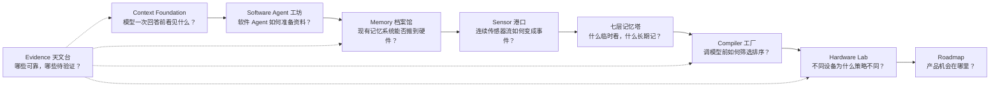
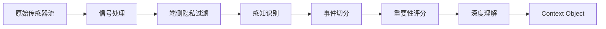
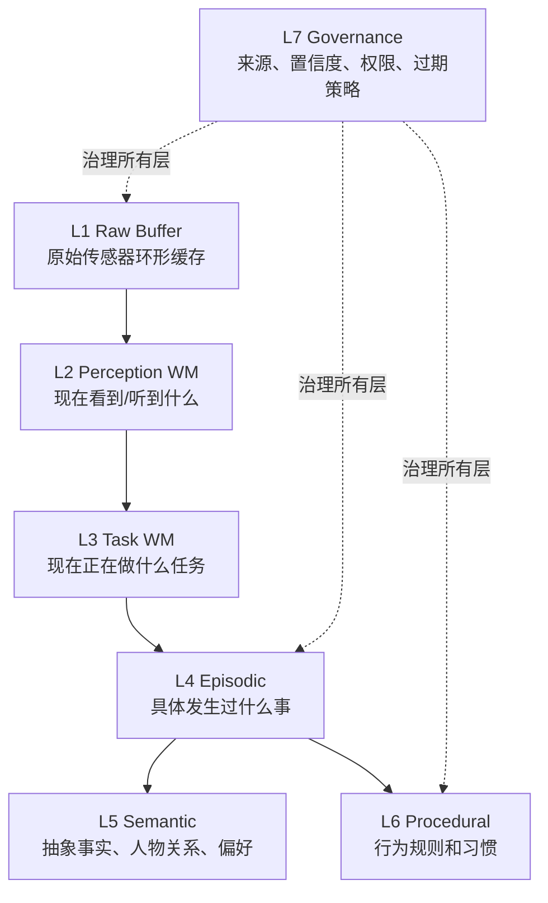
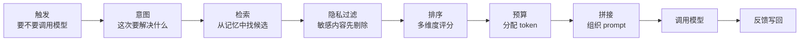

# 90 分钟工作坊分享方案：智能硬件时代的 Context Engineering

## 1. 分享定位

### 1.1 一句话主命题

下一代 AI 终端的竞争力，不只是模型有多强，而是设备能否把真实世界**编译**成模型可用、可信、低打扰的上下文。

### 1.2 面向听众

这场分享面向资深产品经理。默认他们了解 AI 产品形态，但不一定熟悉 LLM 系统架构、Prompt Assembly、Memory Framework 或多模态 Context Pipeline。

因此讲法应做到：

- 保留必要专业术语，体现研究专业性。
- 每个术语第一次出现时都给一句白话解释。
- 不从技术栈讲起，而从产品问题讲起。
- 不把材料讲成论文综述，而把它讲成一套产品架构判断框架。

### 1.3 希望听众带走的能力

听众结束后应能判断一个 AI 硬件产品是否具备下一代体验所需的 Context 能力：

1. 它知道当前发生了什么吗？
2. 它知道哪些信息值得记住吗？
3. 它能在调模型前选出真正有用的信息吗？
4. 它会不会乱记、乱说、乱打扰？
5. 它的记忆和主动服务能否被用户理解和控制？

## 2. 开场场景：用张工贯穿全场

建议全场始终围绕同一个具体例子展开，避免架构变抽象。

### 2.1 场景设定

用户戴着 AI 眼镜走进办公室走廊，迎面看到张工。系统识别到张工是技术部同事，并知道上周张工在周会上提到“API 对接可能延期一周”。

关键问题不是：

> 模型会不会回答“张工是谁”？

而是：

> 系统应不应该提醒用户？如果提醒，应该在什么时候、用什么方式、给模型看哪些资料、避开哪些隐私和社交风险？

### 2.2 用这个场景串联 8 个问题

| 追问 | 对应模块 |
|---|---|
| 模型这次能看到哪些资料？ | Context Window |
| 软件 Agent 已经怎么准备资料？ | Prompt Assembly |
| 张工相关记忆存在哪里？ | Memory Framework / 七层记忆 |
| 眼镜如何把视频流变成“遇到张工”这个事件？ | Context Object |
| 这件事值不值得记？ | Importance / Confidence / Privacy |
| 这次调用模型前该选哪些记忆？ | Context Compiler / Ranker |
| 应该用 AR、震动还是语音？ | Device-specific Strategy |
| 为什么系统知道这件事，用户能不能删？ | Governance Memory |

## 3. 一张问题地图

开场用“Context Engineering 研究城市”作为总览地图。地图不是目录，而是帮助 PM 建立问题空间。

### 3.1 地图区域与关键问题

| 地图区域 | PM 听得懂的问题 | 专业术语 |
|---|---|---|
| Context Foundation | 模型一次回答前，到底“看见”了什么？ | Context Window |
| Software Agent 工坊 | 软件 Agent 已经怎么给模型准备资料？ | Prompt Assembly |
| Memory 档案馆 | 现有记忆系统能不能直接搬到硬件？ | Agent Memory Framework |
| Sensor 港口 | 摄像头、麦克风这些连续流，怎么变成可用信息？ | Context Object |
| 七层记忆塔 | 什么该临时看一眼，什么该长期记住？ | Hierarchical Memory |
| Compiler 工厂 | 每次调用模型前，系统如何筛选、排序、压缩？ | Context Compiler |
| Hardware Lab | 眼镜、耳机、挂坠、机器人为什么策略不同？ | Device-specific Context Strategy |
| Evidence 天文台 | 哪些结论可靠，哪些还只是待验证假设？ | Evidence Matrix / Open Questions |

### 3.2 主路表达

建议在开场直接讲出这条主路：

> 我们今天不是从模型参数讲起，而是沿着一次 AI 终端服务用户的过程走一遍：模型能看什么，软件系统怎么装配上下文，现有记忆系统缺什么，硬件输入为什么复杂，哪些信息值得记，调模型前怎么选，落到眼镜、耳机、挂坠、机器人时又有什么不同，最后看产品机会。

## 4. 90 分钟节奏

| 时间 | 模块 | 目标 | 讲法 |
|---|---|---|---|
| 0-10 分钟 | 开场问题 | 建立“这不是模型问答问题，而是 Context 编译问题” | 张工场景 + 一张研究城市地图 |
| 10-20 分钟 | 模型的一次工作台 | 解释 Context Window 和信息来源 | 工作台比喻 + RAG/Memory/Tool 边界 |
| 20-32 分钟 | 软件 Agent 样板 | 说明 Prompt Assembly 已经在软件里发生 | Claude Code / Cursor / ChatGPT Memory 案例 |
| 32-45 分钟 | 硬件让问题升级 | 讲清连续、多模态、高带宽、隐私风险 | 10,000:1 压缩 + 传感器港口 |
| 45-58 分钟 | 什么值得被记住 | 引入 Context Object 和记忆写入判断 | 会议场景互动：哪些写入、哪些丢弃 |
| 58-70 分钟 | 七层记忆塔 | 建立硬件记忆分层直觉 | 每层一句话 + 张工场景落位 |
| 70-82 分钟 | Context Compiler 工厂 | 说明模型调用前的筛选、排序、拼接 | 9 步 pipeline + Ranker 练习 |
| 82-90 分钟 | 设备差异与机会 | 回到产品判断和路线图 | 四类设备矩阵 + 近期机会 |

## 5. 分段讲法

### 5.1 0-10 分钟：开场问题

**一句话结论**

AI 硬件体验的难点，不是“能不能接上大模型”，而是“能不能在正确时刻给模型正确上下文”。

**推荐讲法**

1. 展示张工场景。
2. 问听众：你希望眼镜提醒你吗？
3. 进一步追问：如果正在和张工对话，提醒会不会尴尬？如果提醒内容不准，会不会更糟？
4. 引出全场问题：AI 终端必须同时解决“知道什么”和“该不该说”。

**互动问题**

> 如果你是这个眼镜的 PM，你最担心什么：识别错人、提示太晚、提示内容没用、侵犯隐私，还是社交场合太打扰？

**风险提醒**

不要把这个例子讲成“人脸识别产品”，重点是 Context 管理链路。

### 5.2 10-20 分钟：模型的一次工作台

**一句话定义**

Context Window 是模型这一次调用能看到的全部信息，相当于一张临时摆好的工作台。

**核心内容**

- 模型不是在每次回答时自动拥有全部世界知识、全部用户历史和全部设备状态。
- 系统必须在调用模型前，把 system prompt、用户请求、历史对话、检索结果、工具结果、记忆和约束摆到工作台上。
- 长上下文模型能让桌子变大，但不能替代信息选择、排序和记忆治理。

**PM 可理解的比喻**

如果模型像一个临时加入项目的专家，Context Window 就是你在会议前递给他的资料包。资料包越厚不一定越好，关键是资料是否相关、可信、按正确顺序组织。

**深入点**

| 概念 | 白话解释 |
|---|---|
| RAG | 从资料库里找相关文档 |
| Memory | 系统长期维护的用户、项目或事件状态 |
| Tool Context | 工具刚刚返回的实时结果 |

**架构结论**

产品体验的差异会越来越多地来自“资料包怎么准备”，而不是只来自“问题怎么写得漂亮”。

### 5.3 20-32 分钟：软件 Agent 已经给了样板

**一句话定义**

Prompt Assembly 是调模型前的资料装配过程。

**核心内容**

- Claude Code 会加载项目规则、工具结果、对话历史，并在上下文过长时压缩。
- Cursor 会围绕当前代码、索引和编辑状态选取上下文。
- ChatGPT Memory 会把部分长期用户记忆带入对话。
- LangGraph 区分 Thread State 和 Memory Store，类似“当前工作状态”和“长期存储”。

**PM 可理解的比喻**

软件 Agent 已经像一个资料助理：它不是把所有文件都交给模型，而是先看任务，再挑资料，再整理成模型能读的结构。

**架构结论**

智能硬件不是从零开始，它可以继承软件 Agent 的 Context Engineering 思路；但硬件输入从文本变成现实世界传感器流后，复杂度上升一个量级。

**过渡语**

> 软件 Agent 面对的是项目规则、代码文件和对话历史；智能眼镜面对的是摄像头、麦克风、人的动作、地点和旁人的隐私。接下来问题就变成：现实世界怎么进入这张工作台？

### 5.4 32-45 分钟：为什么硬件让问题升级

**一句话结论**

智能硬件的输入不是一段文本，而是连续、多模态、高带宽、带噪声、带隐私风险的现实世界流。

**核心内容**

| 软件 Agent | 智能硬件 Agent |
|---|---|
| 用户主动输入文本 | 设备持续感知环境 |
| 输入低频、低带宽 | 视频、音频、IMU、GPS 持续产生 |
| 错误主要是答错 | 错误可能造成打扰、隐私和物理风险 |
| 资料多为文档和历史 | 资料是场景、人物、动作、位置、设备状态 |

**关键数字**

原始传感器到 prompt 约是 **10,000:1** 的压缩过程。这个压缩不是简单删减，而是：

**架构结论**

智能硬件必须先把连续现实切成离散事件，再决定哪些事件值得进入记忆或模型调用。

**风险提醒**

隐私过滤不能放在云端深度理解之后，必须尽早在端侧发生。

### 5.5 45-58 分钟：什么值得被记住

**一句话定义**

Context Object 是把现实世界的一段事件打包成模型和记忆系统能读的结构化对象。

**核心内容**

一个会议事件不应该只存“录音文件”，而应提炼成：

- 发生时间和地点。
- 参与人。
- 事件摘要。
- 关键承诺或待办。
- 置信度。
- 隐私级别。
- 是否值得写入长期记忆。

**互动练习**

给听众一个会议片段：

> 张工在 3F 会议室说：“下周三前我们需要完成 API 对接。”旁边还有一位未知同事，白板上有流程图，用户没有发言但一直在听。

让听众把信息分成四类：

| 类别 | 示例 |
|---|---|
| 只临时使用 | 当前会议室、用户正在听 |
| 值得写入事件记忆 | 张工提到 API 对接截止时间 |
| 可归纳为长期知识 | 张工负责 API 模块 |
| 需要谨慎或不存 | 未知同事身份、旁人原始语音 |

**深入点**

| 字段 | PM 解释 |
|---|---|
| importance | 这件事值不值得记 |
| confidence | 系统有多确定 |
| privacy | 是否涉及敏感或旁人数据 |
| actionable item | 能否变成后续行动 |

**架构结论**

“记忆能力”不是多存数据，而是把可行动、可信、可治理的信息留下来。

### 5.6 58-70 分钟：七层记忆塔

**一句话结论**

不是所有记忆都住在同一层楼；智能硬件至少需要区分实时感知、当前任务、具体事件、抽象知识、行为规则和治理信息。

**每层用一句话讲清楚**

| 层级 | 白话解释 | 张工场景 |
|---|---|---|
| L1 Raw Buffer | 刚刚看到和听到的原始数据，短暂缓存 | 最近 30 秒视频和音频 |
| L2 Perception WM | 当前场景理解 | 面前有张工，用户正看着他 |
| L3 Task WM | 当前任务状态 | 判断是否要给用户提示 |
| L4 Episodic | 具体事件记录 | 上周张工说 API 可能延期 |
| L5 Semantic | 抽象关系和知识 | 张工是技术部同事，负责 API |
| L6 Procedural | 行为规则 | 工作场合优先 AR，不要语音外放 |
| L7 Governance | 记忆的管理信息 | 这条记忆来自会议转录，置信度 0.88，含旁人数据 |

**架构结论**

短期感知和当前任务必须分开；否则每次传感器变化都会让系统误以为任务变化。

**风险提醒**

没有 Governance 层，记忆越强，用户越不信任。

### 5.7 70-82 分钟：Context Compiler 工厂

**一句话定义**

Context Compiler 是把感知、记忆、任务和约束编译成模型输入的总控系统。

**PM 比喻**

它像一个信息总编：不是所有素材都上头条，它要判断哪些可信、哪些相关、哪些太敏感、哪些会打扰用户。

**Ranker 讲法**

不要只讲“相关性”，要讲 PM 能感知的多维判断：

| 评分维度 | 产品含义 |
|---|---|
| TaskRelevance | 和当前任务有多相关 |
| Recency | 信息是否新鲜 |
| SpatialRelevance | 和当前位置/场景是否相关 |
| Confidence | 信息是否可信 |
| Actionability | 能否驱动一个有用行动 |
| PrivacyRisk | 是否有隐私风险 |
| InterruptionCost | 会不会不合时宜地打扰 |
| TokenCost | 占用模型工作台多少空间 |

**互动练习**

回到张工场景，给 4 条候选记忆：

1. 上周张工说 API 对接可能延期。
2. 三个月前张工喜欢喝拿铁。
3. 刚刚看到张工在走廊，但识别置信度只有 0.52。
4. 张工和另一位同事的私人对话片段。

请听众选择哪些可以进入 prompt。  
标准答案：1 可进入；2 通常不进入；3 低置信不进入长期决策；4 因隐私风险不进入。

**架构结论**

AI 硬件主动服务的核心不是“多调用模型”，而是建立调用前的 Pre-flight Check。

### 5.8 82-90 分钟：设备差异与产品机会

**一句话结论**

统一的是 Context Engineering 框架，差异化的是设备形态、输入模态、延迟要求、输出通道和风险边界。

| 设备 | 主要输入 | 关键记忆 | 最大风险 | Context 策略 |
|---|---|---|---|---|
| AI 眼镜 | 视觉 + 语音 | 空间、人物、近期事件 | 拍摄隐私、社交尴尬 | SpatialRelevance 高权重，输出克制 |
| AI 耳机 | 语音 | 对话、人物、近期上下文 | 打断对话 | 低延迟，1-3 词提示 |
| 录音挂坠 | 全天音频 | 事件、承诺、待办 | 旁人隐私、误记忆 | 事后摘要，透明可删 |
| 机器人 | 视觉 + 动作状态 | 物体、空间、动作规则 | 物理安全 | Actionability 和 Safety 最高优先 |

**近期 P0 场景**

- 会议记录和待办提取。
- 承诺追踪。
- 低打扰提醒。
- 人物和关系上下文辅助。

**收束语**

> 未来的 AI 终端不是因为“更会聊天”而更有价值，而是因为它更懂场景、更懂记忆边界、更懂什么时候不要打扰用户。

## 6. 术语翻译策略

| 专业术语 | 首次出现时的白话解释 |
|---|---|
| Context Engineering | 给模型准备“该看的资料”的系统工程 |
| Context Window | 模型这一次能看的工作台 |
| Prompt Assembly | 调模型前的资料装配 |
| Context Object | 把现实事件打包成模型能读的结构化对象 |
| Context Compiler | 把感知、记忆、任务和约束编译成 prompt 的总控系统 |
| Token Budget | 模型工作台上的版面预算 |
| Context Ranker | 判断哪条信息更值得进 prompt 的排序器 |
| Governance Memory | 记忆的来源、权限、置信度和删除规则 |
| Episodic Memory | 具体发生过的事 |
| Semantic Memory | 从多次事件中归纳出来的知识 |
| Procedural Memory | 系统学会的行为规则 |
| Interruption Cost | 此刻打扰用户要付出的体验代价 |

## 7. 视觉建议

| 页面/段落 | 主视觉 | 注意事项 |
|---|---|---|
| 开场 | Context Engineering 研究城市地图 | 只放 8 个区域和主路，不塞长文字 |
| Context Window | 模型工作台 / 资料包截面 | 展示不同信息来源如何摆放 |
| Prompt Assembly | 装配台 | 左侧原料，中间筛选压缩，右侧 prompt |
| 硬件输入 | 多模态传感器港口 | 视频、音频、IMU、GPS 汇入 Context Object |
| Context Object | 结构化事件卡片 | 强调 importance/confidence/privacy/action |
| 七层记忆 | 剖面塔 | 每层一句话，不展示完整 JSON |
| Context Compiler | 工厂生产线 | 9 步流程要线性清楚 |
| 设备差异 | 四设备对比矩阵 | 重点对比风险和策略，不做产品评测 |

## 8. 工作坊互动设计

### 8.1 开场投票

问题：张工场景中，系统主动提示用户的最大风险是什么？

选项：

- 识别错人。
- 提示内容不准。
- 提示太晚。
- 社交场合太打扰。
- 涉及隐私。

目的：让听众意识到 AI 硬件不是单点模型问题，而是多约束决策问题。

### 8.2 记忆分类练习

问题：会议片段里哪些信息该写入长期记忆？

输出：临时使用 / 事件记忆 / 语义记忆 / 不该存。

目的：建立“记忆不是全量保存”的产品直觉。

### 8.3 Ranker 排序练习

问题：张工场景中哪些候选记忆可以进入 prompt？

输出：保留 / 降权 / 丢弃 / 因隐私过滤。

目的：理解 Context Compiler 的价值。

### 8.4 设备策略练习

问题：同一条“API 延期”信息，在眼镜、耳机、挂坠、机器人上应如何输出？

参考答案：

- 眼镜：AR 一行字或轻微震动。
- 耳机：极短低声提示。
- 挂坠：事后摘要或待办。
- 机器人：通常无须主动表达，除非影响任务执行。

目的：理解设备形态决定 Context 策略。

## 9. 讲者提示

### 9.1 应该多说

- “系统给模型看什么，比模型怎么说更关键。”
- “不是所有数据都应该进入记忆。”
- “硬件场景下，隐私和打扰成本是 Context 的一部分。”
- “Context Compiler 是主动服务前的总控系统。”
- “产品体验差异会体现在触发、筛选、排序和输出克制上。”

### 9.2 应该少说

- 不展开模型训练、微调、对齐细节。
- 不陷入具体传感器算法实现。
- 不把 MCP、RAG、向量数据库讲成主线。
- 不做泛泛的智能硬件市场分析。
- 不把案例讲成竞品评测。

### 9.3 关键转场句

- 从开场到 Context Window：  
  “要回答眼镜该不该提示，我们先要知道模型这次到底能看到什么。”

- 从软件到硬件：  
  “软件 Agent 已经证明上下文装配很重要，但硬件面对的不是文档，而是现实世界。”

- 从传感器到记忆：  
  “现实世界不能原样进入模型，它必须先被切成事件，再被判断是否值得记住。”

- 从记忆到 Compiler：  
  “有了记忆还不够，每次调用前系统还要决定拿哪几条出来。”

- 从架构到产品机会：  
  “最终产品差异不是架构图本身，而是设备能否在对的时间，用对的方式，给出对的信息。”

## 10. 结束验收

结尾让听众回到 4 个问题，作为工作坊验收：

1. 为什么“模型更强”不等于“AI 硬件体验更好”？
2. 为什么智能硬件不能把传感器数据直接塞进 prompt？
3. 七层记忆各自解决什么产品问题？
4. 一个 AI 设备主动提醒用户前，至少要判断哪些事？

建议最后给出标准答案：

- 因为体验取决于上下文质量、触发时机、输出通道和风险控制。
- 因为传感器流连续、高带宽、多模态、有噪声且有隐私风险，必须先 Context 化。
- 七层记忆分别处理原始缓存、当前感知、当前任务、具体事件、抽象知识、行为规则和治理信息。
- 主动提醒前至少要判断相关性、置信度、隐私风险、打扰成本、可执行性、输出通道和 token 成本。

## 11. 参考材料定位

本分享方案主要对应以下研究材料：

| 分享模块 | 对应材料 |
|---|---|
| Context Window / 行为特性 | `01_llm_context_management.md` |
| Prompt Assembly / 软件 Agent | `02_software_agent_prompt_assembly.md` |
| Memory Framework | `03_memory_frameworks.md` |
| Sensor → Context Object | `04_hardware_context_inputs.md` |
| 七层记忆架构 | `05_hierarchical_memory_architecture.md` |
| Context Compiler / Ranker | `06_context_compiler.md` |
| 硬件案例 | `07_hardware_case_studies.md` |
| 综合架构和路线图 | `08_final_architecture_and_roadmap.md` |
| 端到端张工示例 | `supplements/worked_examples.md` |
| 证据强度 | `sources/evidence_matrix.md` |
| 开放问题 | `sources/open_questions.md` |

