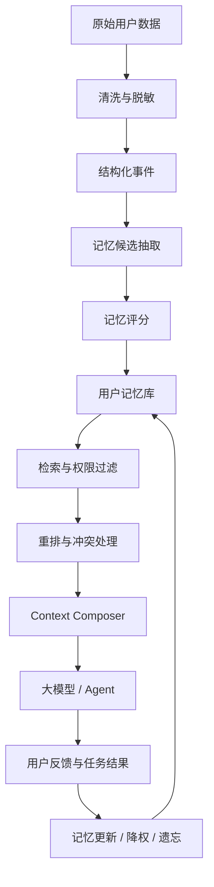

# Context

`context` 是一个围绕 **User Memory Context Engineering** 的研究与原型工作区。

这个仓库关注的问题不是如何把更多历史数据塞进大模型，而是如何把贴身、多端、长期的用户数据加工成短、准、可控、可评估的 Agent 上下文。

## 核心命题

面向智能硬件生态，Agent 的长期优势来自两件事：

1. 从用户真实生活状态、设备状态和长期行为中沉淀可信记忆。
2. 在每次模型调用时，只选择和当前任务最相关、风险最低、信息密度最高的上下文。

因此，本项目把重点放在：

- 用户记忆数据模型。
- 原始数据到记忆的抽取、评分、更新和遗忘流程。
- 面向任务的记忆检索、过滤和重排。
- Context Composer 的上下文组装与 token 预算控制。
- 隐私、授权、审计和用户可控机制。
- 个性化 Agent 的评估体系。

## 系统概览



## 仓库结构

```text
.
├── README.md
├── docs/
│   ├── architecture.md
│   ├── evaluation.md
│   ├── memory-schema.md
│   ├── research-framework.md
│   └── roadmap.md
└── .gitignore
```

## 推荐阅读顺序

1. [docs/research-framework.md](docs/research-framework.md)：完整研究框架原稿。
2. [docs/architecture.md](docs/architecture.md)：系统边界、分层模型和核心模块。
3. [docs/memory-schema.md](docs/memory-schema.md)：事件、记忆、权限和生命周期 Schema。
4. [docs/evaluation.md](docs/evaluation.md)：评估指标、实验分组和测试任务。
5. [docs/roadmap.md](docs/roadmap.md)：MVP 阶段、交付物和近期任务。

## 当前状态

当前仓库处于研究与规划阶段，尚未绑定具体技术栈。后续 PoC 可以从以下方向切入：

- `memory-store`：结构化用户记忆库和索引。
- `memory-extractor`：从事件中抽取候选记忆并评分。
- `context-composer`：面向模型调用的上下文组装器。
- `eval-dataset`：个性化、隐私和冲突处理评估集。

## 设计原则

- 少即是多：只给模型当前任务需要的信息。
- 用户显式反馈优先于行为推断。
- 新近明确表达优先于历史习惯。
- 高敏数据默认不进入模型上下文。
- 每条重要记忆都应可解释、可追溯、可删除。
- 记忆系统必须可评估，不只依赖主观体验。
