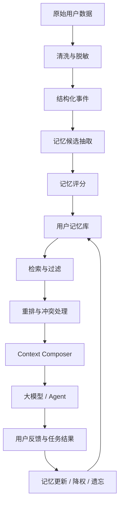

# 智能硬件厂商的用户记忆与 Context 管理研究框架

## 0. 摘要

在基础大模型能力快速趋同、模型厂商竞争激烈的背景下，智能硬件厂商的长期优势不应只来自“接入更强模型”，而应来自对用户生活状态、设备状态和长期行为的理解。

智能硬件厂商拥有手机、手表、耳机、音箱、家电、车机、传感器等多端数据入口，能够持续获得最贴近用户的真实场景数据。这些数据如果被直接塞进大模型上下文，往往会造成噪声、冲突、隐私风险和推理性能下降。真正有价值的方向，是把用户数据加工成可控、可解释、可更新、可检索、可遗忘的用户记忆系统。

因此，本研究的核心命题是：

> 如何把贴身用户数据转化为高质量、低噪声、任务相关、隐私可控的 Agent 记忆，并在每次调用大模型时，只选择最短、最准确、最有用的上下文。

这件事可以被定义为：

> 个人化 Agent 的记忆工程，或 User Memory Context Engineering。

---

## 1. 背景与核心判断

### 1.1 行业背景

当前大模型基础能力持续提升，但也带来几个趋势：

- 基础模型能力逐渐商品化，单纯依赖模型调用难以形成长期壁垒。
- 模型上下文窗口越来越长，但长 context 不等于高质量 context。
- Agent 系统从“单轮问答”转向“长期陪伴、持续任务、跨设备协作”。
- 个性化体验的价值上升，但用户隐私、授权和数据治理要求也同步提高。

对于智能硬件厂商来说，真正的优势不是“拥有更多数据”，而是：

> 拥有持续、真实、多模态、跨场景的用户状态数据，并能把这些数据变成 Agent 可用的用户记忆。

### 1.2 大模型长上下文的实际问题

在实践中，context 变长后模型“变傻”通常不是因为模型能力突然下降，而是因为上下文质量变差：

- 无关信息过多，稀释模型注意力。
- 关键信息位置不佳，模型未能稳定使用。
- 新旧信息冲突，模型无法判断哪个更可信。
- 原始数据粒度太细，模型需要在推理时承担过多清洗工作。
- 用户偏好、设备状态、场景约束混在一起，缺乏结构化表达。
- 敏感信息没有权限控制，带来隐私和合规风险。

因此，研究重点不应是“如何塞入更多上下文”，而应是“如何构造更少、更准、更相关的上下文”。

---

## 2. 问题定义

### 2.1 核心问题

面向智能硬件生态，用户记忆与 context 管理需要回答以下问题：

1. 哪些用户数据值得被记住？
2. 用户记忆应该用什么结构表达？
3. 如何从海量历史数据中检索出和当前任务最相关的记忆？
4. 如何把检索结果压缩成大模型真正能用的上下文？
5. 当用户行为变化时，记忆如何更新、降权、过期或删除？
6. 如何保证隐私、授权、可解释和用户可控？
7. 如何量化评估 context 管理是否真的提升了 Agent 能力？

### 2.2 目标状态

理想状态下，用户每次和 Agent 交互时，系统不是把历史数据全部传给大模型，而是临时生成一个高质量上下文包：

```text
当前任务目标
+ 当前设备和环境状态
+ 与任务相关的少量用户记忆
+ 必要的证据和置信度
+ 隐私和安全约束
+ 可调用工具状态
= 本次模型调用上下文
```

---

## 3. 研究目标

### 3.1 战略目标

构建智能硬件厂商在个人化 Agent 时代的核心壁垒：

> 从用户贴身数据中沉淀长期、可信、可控的个人化记忆，使 Agent 比通用模型更懂用户。

### 3.2 技术目标

- 建立统一的用户记忆数据模型。
- 建立从原始数据到记忆的抽取、评分、更新、遗忘流程。
- 建立任务相关的记忆检索和重排机制。
- 建立 context 压缩与组装策略。
- 建立面向个性化 Agent 的评估体系。
- 建立隐私、权限、审计、用户可控机制。

### 3.3 产品目标

- 让 Agent 能理解用户长期偏好。
- 让 Agent 能跨设备、跨场景提供连续体验。
- 让 Agent 能根据当前环境主动提供帮助。
- 让用户可以查看、修改、删除系统记住的内容。
- 让个性化能力不以牺牲隐私和安全为代价。

---

## 4. 核心概念

### 4.1 Context

Context 是一次模型调用时被放入输入窗口的信息集合。它不等于全部历史，也不等于全部用户数据。

高质量 context 应满足：

- 和当前任务强相关。
- 信息足够短。
- 结构清晰。
- 冲突少。
- 有时间和置信度。
- 符合隐私权限。

### 4.2 Memory

Memory 是从用户历史行为、设备状态、交互记录中提炼出来的长期信息。

记忆可以是：

- 用户偏好。
- 行为规律。
- 重要关系。
- 设备使用习惯。
- 健康和作息趋势。
- 明确表达过的禁忌。
- 任务历史和未完成事项。

### 4.3 Context Engineering

Context Engineering 是围绕大模型输入上下文进行系统设计的工程方法，包括：

- 信息选择。
- 信息压缩。
- 信息排序。
- 信息结构化。
- 信息权限控制。
- 信息评估。

### 4.4 User Memory System

User Memory System 是面向个人化 Agent 的外部记忆系统，负责：

- 存储用户记忆。
- 更新用户记忆。
- 检索用户记忆。
- 遗忘用户记忆。
- 解释记忆来源。
- 控制记忆权限。

---

## 5. 总体系统架构



### 5.1 模块说明

| 模块 | 作用 | 关键问题 |
|---|---|---|
| 数据接入 | 汇聚设备、App、云端和用户交互数据 | 数据是否可靠、是否授权 |
| 清洗脱敏 | 去噪、去重、脱敏、规范化 | 哪些数据不应进入记忆系统 |
| 事件结构化 | 把原始数据转成标准事件 | 如何统一多设备数据语义 |
| 记忆抽取 | 从事件中抽取长期有用信息 | 什么值得记住 |
| 记忆评分 | 判断记忆价值和可信度 | 如何处理频率、新近性、重要性 |
| 记忆库 | 存储结构化记忆和索引 | 如何支持检索、审计和删除 |
| 检索重排 | 为当前任务找到最相关记忆 | 如何避免取错、漏取、取太多 |
| Context Composer | 组装最终上下文 | 如何控制 token、顺序和格式 |
| 反馈更新 | 根据用户反馈和任务结果更新记忆 | 如何纠错、遗忘、处理冲突 |

---

## 6. 用户记忆分层模型

建议把用户数据和记忆分为六层，不同层的使用方式不同。

| 层级 | 内容 | 示例 | 是否直接进入模型上下文 |
|---|---|---|---|
| L0 原始数据层 | 传感器、日志、语音、位置、设备状态 | 心率、开灯记录、语音文本、位置轨迹 | 默认不进入 |
| L1 结构化事件层 | 规范化后的单次事件 | 用户 7:42 离家；用户调低卧室灯光 | 少量进入 |
| L2 情景片段层 | 一段时间内的事件组合 | 工作日早晨出门流程 | 按需进入 |
| L3 语义记忆层 | 长期偏好和习惯 | 用户睡前偏好低亮度；早晨喝咖啡 | 经检索后进入 |
| L4 用户画像层 | 稳定、高层次画像 | 作息类型、健康目标、家庭结构 | 谨慎进入 |
| L5 策略与权限层 | 隐私、安全、授权、禁忌 | 不在公共场景播报健康数据 | 必须进入相关调用 |

核心原则：

> 原始数据用于追溯，结构化事件用于分析，语义记忆用于个性化，策略权限用于约束 Agent。

---

## 7. 数据治理与清洗

### 7.1 数据来源

智能硬件生态可用数据包括：

- 可穿戴设备：心率、睡眠、运动、压力、体温、活动模式。
- 手机：位置、日程、应用使用、通知、输入行为。
- 耳机：佩戴状态、噪声环境、通话场景。
- 音箱：家庭语音交互、家庭成员识别、家居控制。
- 智能家居：灯光、空调、门锁、安防、厨房设备。
- 车机：通勤路线、驾驶习惯、车内环境。
- 售后与客服：设备故障、维修历史、投诉偏好。
- 用户显式反馈：喜欢、不喜欢、以后不要、记住这个。

### 7.2 清洗原则

- 去重：合并多设备重复上报的同一事件。
- 降噪：过滤偶发、异常、无意义事件。
- 对齐：统一时间、地点、设备、用户身份。
- 归因：标记数据来源和可信度。
- 脱敏：删除或模糊不必要的敏感字段。
- 最小化：只保留未来任务可能用到的信息。

### 7.3 敏感数据分级

| 等级 | 数据类型 | 使用策略 |
|---|---|---|
| 低敏 | 设备偏好、亮度、音量、常用模式 | 可用于个性化 |
| 中敏 | 位置、作息、家庭场景、联系人关系 | 需场景授权和最小化使用 |
| 高敏 | 健康、财务、身份、儿童、私密对话 | 默认不进入模型，需显式授权 |
| 禁用 | 法律禁止或用户拒绝的数据 | 不采集、不推断、不使用 |

---

## 8. 用户记忆数据模型

不建议只存自然语言，也不建议只存向量。每条记忆都应同时包含自然语言、结构化字段、证据、时间、置信度和权限信息。

### 8.1 推荐 Schema

```json
{
  "memory_id": "mem_001",
  "user_id": "user_123",
  "type": "preference.environment.light",
  "summary": "用户睡前偏好卧室灯光低亮度、暖色温。",
  "structured_value": {
    "room": "bedroom",
    "brightness": "low",
    "color_temperature": "warm",
    "time_window": "before_sleep"
  },
  "evidence": [
    {
      "event_id": "evt_101",
      "source": "smart_light",
      "timestamp": "2026-06-10T22:45:00+08:00"
    }
  ],
  "confidence": 0.84,
  "importance": 0.72,
  "last_seen": "2026-06-15T22:38:00+08:00",
  "valid_from": "2026-05-01",
  "valid_until": null,
  "sensitivity": "low",
  "allowed_scenarios": ["smart_home", "sleep_assistant"],
  "denied_scenarios": ["public_voice_broadcast"],
  "status": "active",
  "conflicts_with": [],
  "created_at": "2026-06-01T10:00:00+08:00",
  "updated_at": "2026-06-15T22:40:00+08:00"
}
```

### 8.2 关键字段解释

| 字段 | 作用 |
|---|---|
| type | 记忆类型，支持分类检索 |
| summary | 给模型看的简短自然语言 |
| structured_value | 给系统和工具使用的结构化值 |
| evidence | 记忆来源，支持解释和审计 |
| confidence | 可信度 |
| importance | 重要度 |
| last_seen | 最近一次被验证的时间 |
| valid_until | 过期时间 |
| sensitivity | 敏感等级 |
| allowed_scenarios | 允许使用场景 |
| status | active、deprecated、pending_confirmation、deleted |
| conflicts_with | 冲突记忆列表 |

---

## 9. 什么值得记住：记忆评分机制

### 9.1 记忆价值评分

可以为每条候选记忆计算综合分：

```text
memory_score =
  w1 * task_value
+ w2 * frequency
+ w3 * recency
+ w4 * stability
+ w5 * explicitness
+ w6 * user_feedback
- w7 * sensitivity_risk
- w8 * conflict_risk
```

### 9.2 评分维度

| 维度 | 含义 |
|---|---|
| task_value | 对未来任务是否有用 |
| frequency | 是否多次出现 |
| recency | 最近是否仍然成立 |
| stability | 是否长期稳定 |
| explicitness | 是否来自用户明确表达 |
| user_feedback | 用户是否确认、纠正或强化 |
| sensitivity_risk | 是否涉及敏感数据 |
| conflict_risk | 是否和已有记忆冲突 |

### 9.3 记忆进入规则

建议初期采用保守策略：

- 用户明确表达的偏好优先进入记忆。
- 多次重复出现的行为可进入候选记忆。
- 单次偶发事件默认不进入长期记忆。
- 高敏数据必须显式授权。
- 与旧记忆冲突时，进入待确认状态，而不是直接覆盖。

---

## 10. 记忆检索与重排

### 10.1 检索不是单一向量召回

个人化 Agent 的记忆检索应使用混合策略：

- 语义向量检索：找含义相近的记忆。
- 关键词检索：找设备名、地点、人名、具体对象。
- 时间过滤：最近、长期、特定时间段。
- 场景过滤：健康、出行、家居、客服、陪伴。
- 权限过滤：当前场景是否允许使用该记忆。
- 置信度过滤：低置信记忆不直接使用。
- 重排模型：综合任务相关性、重要度和风险。

### 10.2 检索流程

```text
用户请求 / 当前任务
 -> 任务分类
 -> 场景权限判断
 -> 初步召回记忆
 -> 时间、权限、敏感度过滤
 -> rerank
 -> 冲突检测
 -> context 预算裁剪
 -> 输出给 Context Composer
```

### 10.3 重排优先级

推荐排序因子：

1. 与当前任务直接相关。
2. 用户显式确认过。
3. 最近仍被验证。
4. 置信度高。
5. 敏感度低。
6. 信息短且清晰。
7. 无冲突或冲突已解决。

---

## 11. Context Composer 设计

Context Composer 是整个系统的核心。它决定最终给模型看什么、怎么排、占多少 token。

### 11.1 上下文组成

一次高质量模型调用可以包含：

```text
1. 系统规则
2. 当前任务
3. 当前环境和设备状态
4. 相关用户记忆
5. 必要证据
6. 权限和隐私约束
7. 可调用工具
8. 输出格式要求
```

### 11.2 推荐格式

```markdown
## 当前任务
用户希望系统在睡前自动调整卧室环境。

## 当前状态
- 时间：22:35
- 用户位置：家中卧室
- 当前卧室灯光：亮度 70%，冷色温
- 当前空调：26°C

## 相关用户记忆
- 用户睡前偏好卧室灯光低亮度、暖色温。置信度：0.84，最近验证：2026-06-15。
- 用户工作日通常 23:00 前入睡。置信度：0.76，最近验证：2026-06-12。

## 隐私与行为约束
- 不要主动播报健康数据。
- 如果需要改变多个设备状态，应先给出简短确认。

## 期望输出
给出一句自然语言回复，并列出建议执行的设备动作。
```

### 11.3 Token 预算建议

| 内容 | 预算占比 |
|---|---|
| 系统规则 | 10%-20% |
| 当前任务和对话 | 20%-30% |
| 当前设备状态 | 10%-20% |
| 用户记忆 | 20%-30% |
| 工具结果和证据 | 10%-20% |
| 安全约束 | 必须保留 |

原则：

> 用户记忆不是越多越好。每次只放入能改变模型决策的记忆。

---

## 12. 上下文压缩

### 12.1 压缩目标

压缩不是简单总结，而是把历史信息转成可继续推理的状态。

应保留：

- 用户目标。
- 用户偏好。
- 已确认事实。
- 未完成任务。
- 决策依据。
- 冲突和不确定性。
- 最近变化。

应删除：

- 寒暄。
- 重复内容。
- 无关细节。
- 低置信推断。
- 过期信息。
- 不允许使用的敏感数据。

### 12.2 压缩输出格式

```json
{
  "user_goal": "改善睡眠质量",
  "confirmed_preferences": [
    "睡前偏好低亮度暖色灯光",
    "不喜欢语音助手在夜间主动说太多话"
  ],
  "recent_changes": [
    "最近一周入睡时间比过去推迟约 40 分钟"
  ],
  "open_questions": [
    "是否希望系统在 22:30 自动开启睡前模式"
  ],
  "do_not_use": [
    "未授权使用健康数据进行主动播报"
  ]
}
```

---

## 13. 记忆更新、遗忘与冲突处理

### 13.1 记忆更新

用户记忆应支持持续演化：

- 新证据支持旧记忆：提升置信度。
- 新证据削弱旧记忆：降低置信度。
- 用户明确纠正：立即更新或废弃。
- 长期未出现：逐步降权。
- 存在冲突：进入待确认状态。

### 13.2 遗忘机制

遗忘不是简单删除，而是根据场景分层处理：

| 情况 | 处理方式 |
|---|---|
| 用户主动删除 | 物理删除或不可恢复删除 |
| 过期偏好 | status 改为 deprecated |
| 长期未验证 | 降低权重 |
| 敏感临时信息 | 到期自动删除 |
| 错误记忆 | 标记 rejected 并避免再次生成 |

### 13.3 冲突处理

示例：

- 旧记忆：用户喜欢早晨喝咖啡。
- 新信息：用户说“最近别再推荐咖啡了”。

系统不应简单平均，而应生成：

```json
{
  "old_memory": "用户早晨偏好喝咖啡",
  "new_signal": "用户最近不希望推荐咖啡",
  "resolution": "新信息优先，旧记忆降权",
  "status": "active_with_recent_override",
  "suggested_behavior": "近期不主动推荐咖啡，必要时询问是否为临时偏好变化"
}
```

---

## 14. 与智能硬件生态结合的关键场景

### 14.1 智能家居 Agent

能力方向：

- 理解用户在不同时间、房间、家庭成员状态下的偏好。
- 自动生成个性化场景模式。
- 根据反馈微调设备动作。

示例：

> 用户晚上回家后，系统根据时间、位置、过往习惯、当前温湿度，自动建议打开玄关灯、调低客厅亮度、设置空调到常用温度。

### 14.2 健康与睡眠 Agent

能力方向：

- 识别长期趋势，而不是只看单日数据。
- 把健康建议和用户作息、工作压力、运动习惯结合。
- 严格控制健康数据使用边界。

注意：

> 健康相关场景必须区分生活建议和医疗建议，避免让模型做未经授权或高风险判断。

### 14.3 出行与日程 Agent

能力方向：

- 学习通勤规律。
- 结合天气、交通、日程、设备状态进行提醒。
- 根据用户打断反馈优化提醒频率。

### 14.4 设备服务与故障诊断 Agent

能力方向：

- 结合设备日志、用户使用习惯、历史维修记录。
- 给出更短的排障路径。
- 自动判断是否需要人工客服介入。

### 14.5 陪伴型 Agent

能力方向：

- 记住用户长期偏好、重要事件、关系和情绪模式。
- 支持多轮长期对话。
- 严格处理情感依赖、未成年人和心理健康边界。

---

## 15. 评估体系

没有评估体系，context 管理会退化成“凭感觉调 prompt”。

### 15.1 核心指标

| 指标 | 含义 |
|---|---|
| Memory Precision | 检索出的记忆有多少真正相关 |
| Memory Recall | 应该用到的关键记忆是否被取出 |
| Personalization Gain | 相比无记忆版本，任务成功率提升多少 |
| Context Efficiency | 每 1K token 带来的效果提升 |
| Staleness Error | 是否使用过期记忆 |
| Conflict Handling | 是否正确处理新旧偏好冲突 |
| Privacy Leakage | 是否在不该用时使用敏感信息 |
| User Correction Rate | 用户纠正系统记忆的频率 |
| Latency | 检索、重排、压缩带来的延迟 |
| Cost | 每次个性化调用的额外成本 |

### 15.2 对照实验

建议至少比较五组：

1. 无用户记忆。
2. 只放最近 N 条对话。
3. 普通向量 RAG。
4. 混合检索 + 结构化记忆。
5. 混合检索 + 结构化记忆 + 压缩 + 冲突处理。

### 15.3 测试任务样例

| 场景 | 测试问题 | 评估重点 |
|---|---|---|
| 智能家居 | 用户说“我准备睡了”，系统该做什么 | 是否调用睡前偏好 |
| 健康 | 用户最近睡眠变差，系统如何建议 | 是否避免医疗化判断 |
| 出行 | 明早有会议，是否提前提醒 | 是否结合通勤规律 |
| 设备售后 | 用户耳机降噪异常，如何排查 | 是否结合设备日志 |
| 偏好冲突 | 用户过去喜欢咖啡，现在说不要推荐 | 是否新信息优先 |
| 隐私 | 家里有客人时是否播报健康数据 | 是否遵守隐私约束 |

---

## 16. MVP 路线图

### 阶段 1：数据资产地图，2-3 周

目标：

- 梳理现有设备和 App 可用数据。
- 标注数据可靠性、敏感度、授权状态。
- 选定 2-3 个高价值场景。

产出：

- 用户数据资产地图。
- 场景数据需求表。
- 隐私风险清单。

### 阶段 2：记忆 Schema 和事件标准，3-4 周

目标：

- 定义统一事件模型。
- 定义用户记忆 Schema。
- 建立记忆类型 taxonomy。

产出：

- Event Schema。
- Memory Schema。
- 记忆分类体系。
- 样例数据集。

### 阶段 3：记忆抽取与检索 PoC，4-6 周

目标：

- 从历史数据中抽取记忆候选。
- 建立记忆评分。
- 建立混合检索和 rerank。
- 初步接入一个 Agent 场景。

产出：

- 记忆抽取 pipeline。
- 用户记忆库。
- 检索服务。
- 场景 demo。

### 阶段 4：Context Composer 和评估集，4-6 周

目标：

- 实现上下文组装。
- 实现 token 预算控制。
- 构建个性化评测集。
- 对比不同记忆策略效果。

产出：

- Context Composer 服务。
- eval 数据集。
- 实验报告。
- MVP 产品建议。

### 阶段 5：用户可控与线上灰度，6-8 周

目标：

- 用户可查看、编辑、删除记忆。
- 增加权限控制和审计。
- 小流量灰度验证。

产出：

- 用户记忆管理界面。
- 权限和审计系统。
- 灰度实验数据。
- 产品化决策报告。

---

## 17. 团队分工建议

| 角色 | 主要职责 |
|---|---|
| 产品负责人 | 定义个性化场景、用户价值、体验边界 |
| 算法工程师 | 记忆抽取、评分、检索、重排、压缩 |
| 后端工程师 | 数据管道、记忆库、服务接口、权限系统 |
| 客户端 / 设备工程师 | 数据采集、边缘处理、设备状态同步 |
| 数据治理 / 安全 | 隐私、合规、脱敏、审计 |
| 评测工程师 | 构建 eval、标注任务、分析效果 |
| UX 设计师 | 用户记忆可控界面、授权和纠错体验 |

---

## 18. 关键风险

### 18.1 技术风险

- 记忆抽取错误导致 Agent 误解用户。
- 检索召回错误导致个性化体验下降。
- 长期记忆冲突没有被正确处理。
- 多设备数据身份对齐错误。
- 压缩过程丢失关键约束。

### 18.2 产品风险

- 用户觉得系统“太懂我”，产生被监控感。
- 主动提醒过多，造成打扰。
- 个性化不可解释，用户无法纠正。
- 错误记忆反复出现，降低信任。

### 18.3 隐私与合规风险

- 未授权使用敏感数据。
- 在公共场景泄露私人信息。
- 无法满足用户删除或导出请求。
- 健康、儿童、家庭成员数据处理不当。

---

## 19. 设计原则

1. 少即是多：只给模型当前任务需要的信息。
2. 用户显式反馈优先于行为推断。
3. 新近明确表达优先于历史习惯。
4. 高敏数据默认不进入模型上下文。
5. 每条重要记忆都应可解释、可追溯、可删除。
6. 记忆系统必须有评估，不应只靠主观体验。
7. 端侧能处理的敏感信息，优先在端侧处理。
8. 个性化能力要让用户感到可控，而不是被窥探。

---

## 20. 近期最值得研究的 10 个问题

1. 如何判断一条用户行为是否值得沉淀为长期记忆？
2. 用户显式偏好和隐式行为冲突时，谁优先？
3. 如何设计适合智能硬件场景的用户记忆 taxonomy？
4. 如何用最少 token 表达用户偏好、设备状态和隐私约束？
5. 如何评估一条记忆对任务成功率的真实贡献？
6. 如何让用户低成本纠正错误记忆？
7. 如何在端侧完成敏感数据摘要，只上传非敏感记忆？
8. 如何处理家庭多人场景中的身份、权限和偏好冲突？
9. 如何避免 Agent 因过度个性化而打扰用户？
10. 如何把记忆系统变成跨设备生态的公共能力？

---

## 21. 推荐参考方向

以下方向值得进一步跟踪：

- Long Context Robustness：研究模型在长上下文中的信息利用问题。
- Retrieval-Augmented Generation：研究外部知识和记忆检索。
- Agent Memory：研究长期对话、反思、记忆更新。
- Context Engineering：研究上下文组装、压缩和工具结果管理。
- Privacy-Preserving Personalization：研究隐私保护下的个性化。
- Edge AI Memory Extraction：研究端侧记忆抽取和摘要。

参考材料：

- Lost in the Middle: How Language Models Use Long Contexts
  https://arxiv.org/abs/2307.03172
- Retrieval-Augmented Generation for Knowledge-Intensive NLP Tasks
  https://arxiv.org/abs/2005.11401
- MemGPT: Towards LLMs as Operating Systems
  https://arxiv.org/abs/2310.08560
- MemoryBank: Enhancing Large Language Models with Long-Term Memory
  https://arxiv.org/abs/2305.10250
- Generative Agents: Interactive Simulacra of Human Behavior
  https://arxiv.org/abs/2304.03442
- Anthropic: Contextual Retrieval
  https://www.anthropic.com/engineering/contextual-retrieval
- Anthropic: Effective Context Engineering for AI Agents
  https://www.anthropic.com/engineering/effective-context-engineering-for-ai-agents
- OpenAI: Evaluation Best Practices
  https://developers.openai.com/api/docs/guides/evaluation-best-practices

---

## 22. 结论

智能硬件厂商在 Agent 时代的核心机会，不是简单接入大模型，也不是把用户数据大量塞入上下文，而是建立一套系统化的用户记忆工程能力。

这套能力的本质是：

> 把连续、贴身、多模态的用户数据，转化为简短、准确、可控、可评估的个人化上下文。

如果这套系统做好，智能硬件厂商可以形成区别于模型厂商和纯软件厂商的生态壁垒：

- 更理解用户真实生活状态。
- 更懂跨设备场景。
- 更能长期适应用户变化。
- 更能在隐私可控的前提下提供个性化体验。

最终目标不是让 Agent “记住更多”，而是让 Agent “在正确的时候想起正确的事”。
